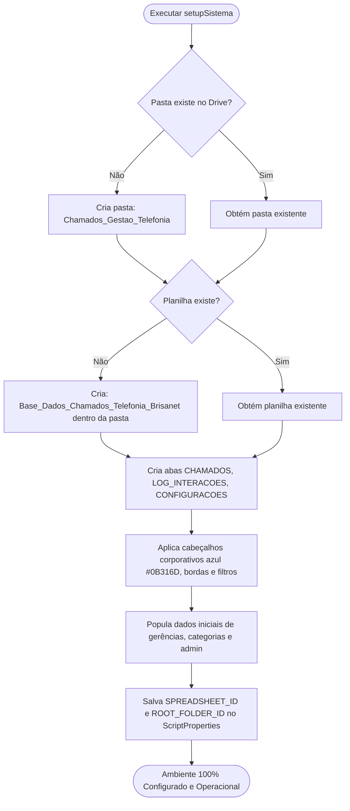

# Especificação de Projeto: Painel de Chamados Administrativos | Gestão de Telefonia • brisanet

---

## 1. Visão Geral e Identidade do Projeto

O sistema é uma plataforma corporativa desenvolvida em **Google Apps Script** com interface web moderna e persistência de dados em **Google Sheets**. Seu objetivo é estruturar, centralizar e agilizar o fluxo de solicitações direcionadas à **Gerência Executiva de Telefonia da brisanet**, oferecendo rastreabilidade completa de status, atendimento com registro de SLA, interações com os solicitantes e histórico de auditoria.

### 1.1. Título Oficial e Nomenclatura Institucional

* **Título da Aplicação:** `Painel de Chamados Administrativos | Gestão de Telefonia`
* **Subtítulo Institucional:** `GERÊNCIA EXECUTIVA DE TELEFONIA | BRISANET`
* **Prefixo de Protocolo:** `BRISA-TEL-2026-0001`
* **Diretório no Google Drive:** `Chamados_Gestao_Telefonia/`
* **Nome da Planilha Base:** `Base_Dados_Chamados_Telefonia_Brisanet`

### 1.2. Diretrizes de Design Corporativo e Marca (brisanet)

* **Tom de Voz e Grafia Institucional:**
  * Referência à marca sempre no feminino: **a brisanet**.
  * Grafia oficial sempre em caixa baixa: **`brisanet`** ou **`brisa`**.
* **Padrão Estético Executivo (Sem Emojis):**
  * **Uso estritamente proibido de emojis** na interface, relatórios, notificações e botões.
  * Ícones exclusivamente vetoriais SVG lineares e discretos (biblioteca *Lucide Icons* ou *Heroicons* via CDN).
  * Design limpo e corporativo, seguindo a identidade visual dos dashboards executivos da brisanet (fundo suave, cards brancos com cantos arredondados, sombras sutis e tipografia bem hierarquizada).
* **Tipografia:**
  * Fonte Primária: **`Figtree`** (Google Fonts) — cabeçalhos, botões, labels e textos gerais.
  * Fonte Secundária / Numérica: **`Rubik`** (Google Fonts) — métricas de KPI, contadores, protocolos e tabelas de dados.
* **Paleta de Cores Oficial:**
  * **Primárias:**
    * Laranja Brisa: `#FF5022` (Ações principais, botões primários, aba ativa, destaques)
    * Azul Brisa: `#2242D4` (Identidade corporativa, métricas de destaque, links e focos)
    * Cinza Claro: `#E8E8E8` (Bordas divisórias, linhas de tabelas e contornos)
  * **Secundárias e Apoio Executivo:**
    * Azul Marinho Escuro: `#0B316D` (Títulos de seções, textos de alto contraste, headers institucionais)
    * Laranja Médio: `#E47D20` (Indicadores de atenção e métricas intermediárias)
    * Pêssego / Laranja Suave: `#E89650` (Badges secundários de fila)
    * Verde Limão Corporativo: `#D0FF60` (Indicadores de conformidade, metas de SLA e status resolvido)
    * Magenta / Rosa Escuro: `#DA2468` (Alertas críticos, cancelamentos e prioridade máxima)
    * Fundo Geral da Aplicação: `#F8FAFC` (Slate neutro ultra-claro para contraste elegante com cards brancos)

---

## 2. Automação de Inicialização (Setup com 1 Clique)

Para eliminar a necessidade de criar pastas e tabelas manualmente, o projeto conta com o módulo `Setup.js` contendo a função `setupSistema()`.

---

## 3. Gestão de Anexos Multi-Formato

O sistema aceita documentos comprobatórios, notas técnicas, orçamentos, imagens de ocorrências e arquivos compactados.

* **Formatos Homologados:**
  * Documentos e Planilhas: PDF, DOCX, DOC, XLSX, XLS, PPTX, CSV, TXT.
  * Imagens: PNG, JPG, JPEG, WEBP.
  * Arquivos Compactados: ZIP, RAR.
* **Processo de Processamento:**
  1. No formulário web, o usuário anexa um ou múltiplos arquivos (com visualizador de nome, extensão e tamanho).
  2. O cliente converte os arquivos em Base64 e despacha ao Apps Script.
  3. O backend cria a pasta do chamado no Google Drive com a nomenclatura:  
     `Chamados_Gestao_Telefonia/{ANO}/{ID_CHAMADO}/`
  4. Salva os arquivos com permissão de visualização e armazena as URLs correspondentes na coluna `URL_ANEXOS` do chamado.

---

## 4. Estrutura do Banco de Dados (Google Sheets)

### 4.1. Aba `CHAMADOS` (Tabela Mestre)
Colunas: `ID_CHAMADO`, `DATA_CRIACAO`, `SOLICITANTE_EMAIL`, `SOLICITANTE_NOME`, `GERENCIA`, `CATEGORIA`, `SUBCATEGORIA`, `PRIORIDADE`, `TITULO`, `DESCRICAO`, `URL_ANEXOS`, `STATUS`, `ATENDENTE_RESPONSAVEL`, `DATA_INICIO_ATENDIMENTO`, `DATA_CONCLUSAO`, `TEMPO_TOTAL_HORAS`.

### 4.2. Aba `LOG_INTERACOES` (Auditoria e Feedbacks)
Colunas: `ID_LOG`, `ID_CHAMADO`, `DATA_HORA`, `AUTOR_EMAIL`, `TIPO_ACAO`, `STATUS_ANTERIOR`, `NOVO_STATUS`, `MENSAGEM_FEEDBACK`, `VISIVEL_SOLICITANTE`.

### 4.3. Aba `CONFIGURACOES` (Parâmetros Dinâmicos)
Colunas: `GERENCIAS_CADASTRADAS`, `CATEGORIAS_TELEFONIA`, `ADMINISTRADORES_AUTORIZADOS`.

---

## 5. Design das Telas (Inspirado no Padrão de Dashboards brisanet)

A experiência de uso baseia-se na arquitetura visual de dashboard corporativo:
* Header Executivo com logo, títulos institucionais e filtros de período com botões `Aplicar` (#FF5022) e `Limpar`.
* Barra de Navegação com abas no padrão pílulas (*Pills*) e ícones vetoriais SVG lineares.
* Seção de Indicadores Executivos com cards de métricas em Azul Brisa (`#2242D4`) e Laranja Brisa (`#FF5022`).
* Grid de chamados com filtros rápidos, badges de status padronizados e gaveta de atendimento com linha do tempo de interações.
